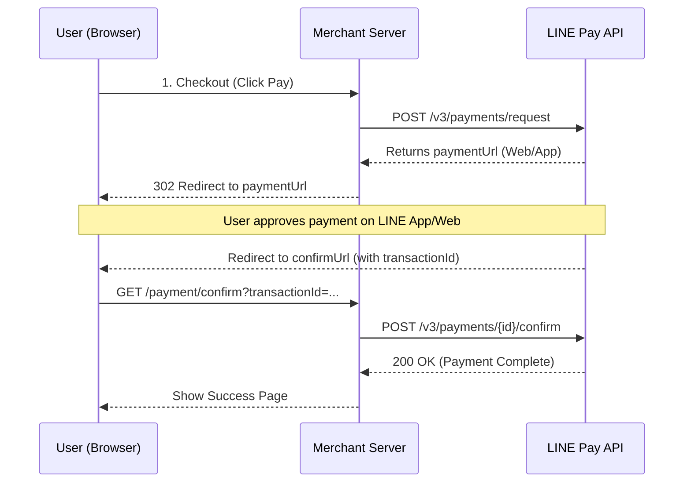

# LINE Pay Online V4 PHP SDK

[](https://github.com/CarlLee1983/line-pay-online-v4-php/actions/workflows/ci.yml)
[](https://packagist.org/packages/carllee/line-pay-online-v4)
[](LICENSE)

**PHP SDK for LINE Pay Online API V4.**
A type-safe, strictly typed library featuring a **Fluent Builder** for constructing complex payment requests. Native support for **Laravel** with auto-discovery and Facades.

**🌐 Language / 語言 / 言語 / ภาษา:**
[English](./README.md) | [繁體中文](./README_ZH.md) | [日本語](./README_JA.md) | [ภาษาไทย](./README_TH.md)

## Features

- ✅ **PHP 8.1+** with strict types
- ✅ **Laravel Integration** - ServiceProvider, Facade, IoC support
- ✅ **Builder Pattern** for request construction
- ✅ **Type-safe Enums** for currencies and options
- ✅ **Comprehensive Validation** before API calls
- ✅ **PHPStan Level Max** static analysis
- ✅ Built on `carllee/line-pay-core-v4`

## Requirements

- PHP 8.1 or higher
- Composer
- ext-json
- ext-openssl

## Installation

```bash
composer require carllee/line-pay-online-v4
```

## Payment Flow



## Quick Start

### Standard PHP Usage

```php
use LinePay\Core\Config\LinePayConfig;
use LinePay\Online\LinePayClient;
use LinePay\Online\Domain\PaymentPackage;
use LinePay\Online\Domain\PaymentProduct;
use LinePay\Online\Enums\Currency;

// Create configuration
$config = new LinePayConfig(
    channelId: getenv('LINE_PAY_CHANNEL_ID'),
    channelSecret: getenv('LINE_PAY_CHANNEL_SECRET'),
    env: 'sandbox'
);

// Create client
$client = new LinePayClient($config);

// Create a package with products
$package = new PaymentPackage(id: 'PKG-001', amount: 1000);
$package->addProduct(new PaymentProduct(
    name: 'Product Name',
    quantity: 1,
    price: 1000
));

// Request payment using Builder Pattern
$response = $client->payment()
    ->setAmount(1000)
    ->setCurrency(Currency::TWD)
    ->setOrderId('ORDER-' . time())
    ->addPackage($package)
    ->setRedirectUrls(
        'https://example.com/confirm',
        'https://example.com/cancel'
    )
    ->send();

// Get payment URL
$paymentUrl = $response['info']['paymentUrl']['web'];
```

## Laravel Integration

The package supports **Laravel Package Discovery**. Just install it via composer, and the ServiceProvider and Facade will be registered automatically.

### Configuration

Publish the config file:

```bash
php artisan vendor:publish --tag=linepay-config
```

Add to your `.env`:

```env
LINE_PAY_CHANNEL_ID=your-channel-id
LINE_PAY_CHANNEL_SECRET=your-channel-secret
LINE_PAY_ENV=sandbox
LINE_PAY_TIMEOUT=20
```

### Using Dependency Injection

```php
namespace App\Http\Controllers;

use LinePay\Online\LinePayClient;
use LinePay\Online\Domain\PaymentPackage;
use LinePay\Online\Enums\Currency;

class PaymentController extends Controller
{
    public function __construct(
        private LinePayClient $linePay
    ) {}

    public function createPayment()
    {
        $package = new PaymentPackage(id: 'PKG-001', amount: 1000);
        
        $response = $this->linePay->payment()
            ->setAmount(1000)
            ->setCurrency(Currency::TWD)
            ->setOrderId('ORDER-' . time())
            ->addPackage($package)
            ->setRedirectUrls(
                route('payment.confirm'),
                route('payment.cancel')
            )
            ->send();

        return redirect($response['info']['paymentUrl']['web']);
    }
}
```

### Using Facade

```php
use LinePay\Online\Laravel\LinePay;
use LinePay\Online\Enums\Currency;

// Confirm payment
$response = LinePay::confirm(
    transactionId: $request->input('transactionId'),
    amount: 1000,
    currency: 'TWD'
);

// Refund
$response = LinePay::refund($transactionId, 500);
```

## API Methods

### Request Payment
```php
$response = $client->payment()
    ->setAmount(1000)
    ->setCurrency(Currency::TWD)
    ->setOrderId('ORDER-001')
    ->addPackage($package)
    ->setRedirectUrls($confirmUrl, $cancelUrl)
    ->send();
```

### Confirm Payment
```php
$response = $client->confirm(
    transactionId: '1234567890123456789',
    amount: 1000,
    currency: Currency::TWD
);
```

### Capture Payment
```php
$response = $client->capture(
    transactionId: '1234567890123456789',
    amount: 1000,
    currency: Currency::TWD
);
```

### Void Payment
```php
$response = $client->void('1234567890123456789');
```

### Refund Payment
```php
// Full refund
$response = $client->refund('1234567890123456789');

// Partial refund
$response = $client->refund('1234567890123456789', 500);
```

### Get Payment Details
```php
$response = $client->getDetails(
    transactionIds: ['1234567890123456789'],
    orderIds: ['ORDER-001']
);
```

### Check Payment Status
```php
$response = $client->checkStatus('1234567890123456789');
```

## Error Handling

```php
use LinePay\Core\Errors\LinePayError;
use LinePay\Core\Errors\LinePayTimeoutError;
use LinePay\Core\Errors\LinePayValidationError;

try {
    $response = $client->confirm($transactionId, 1000, Currency::TWD);
} catch (LinePayValidationError $e) {
    // Validation error (before API call)
    echo "Validation Error: " . $e->getMessage();
} catch (LinePayTimeoutError $e) {
    // Request timeout
    echo "Timeout after " . $e->getTimeout() . " seconds";
} catch (LinePayError $e) {
    // API error
    echo "Error Code: " . $e->getReturnCode();
    echo "Error Message: " . $e->getReturnMessage();
}
```

## Common Pitfalls & Troubleshooting

### 🚫 Double Confirmation (Error 1198)

Each `transactionId` can only be confirmed **once**.

* If users refresh the success page, your server might try to confirm again.
* **Solution:** Check your local database order status *before* calling `$client->confirm()`. If it's already "PAID", skip the API call.

```php
// In your confirm callback handler
$order = Order::where('transaction_id', $transactionId)->first();

if ($order->status === 'PAID') {
    // Already confirmed, just show success page
    return redirect()->route('payment.success');
}

// Only call confirm if not yet paid
$response = $client->confirm($transactionId, $order->amount, Currency::TWD);
$order->update(['status' => 'PAID']);
```

### 💰 Amount Mismatch (Error 1106)

The amount passed to `confirm()` must match the amount requested exactly.

* **Tip:** Do not trust the amount in the URL query string (if any). Always retrieve the amount from your own database using the `orderId`.

```php
// ✗ BAD: Using amount from query string
$amount = $request->input('amount'); // Vulnerable!

// ✓ GOOD: Using amount from database
$order = Order::findOrFail($orderId);
$amount = $order->amount;
```

### ⏱️ Transaction Expiration

The `paymentUrl` and `transactionId` have an expiration time (usually 20 minutes). If the user takes too long, the confirm call will fail.

* Store the expiration time and show a countdown to the user.
* Handle the expiration error gracefully and allow the user to restart the payment.

## Testing

```bash
composer install
composer test
composer analyze
```

## Related Packages

- [`carllee/line-pay-core-v4`](https://github.com/CarlLee1983/line-pay-core-v4-php) - Core SDK (dependency)
- [`carllee/line-pay-offline-v4`](https://github.com/CarlLee1983/line-pay-offline-v4-php) - Offline Payment SDK

## License

MIT License - see [LICENSE](LICENSE) for details.

## Resources

- [LINE Pay API Documentation](https://pay.line.me/documents/online_v3_en.html)
- [LINE Pay Merchant Center](https://pay.line.me/portal/tw/)
